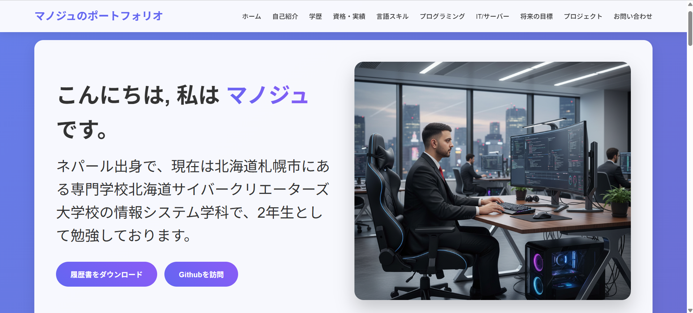

# マノジュ・ポーデル ポートフォリオ

> 個人開発者ポートフォリオサイト - 日本での就職活動・自己紹介用

[](https://241033.daa.jp/portf/index.html)
[](https://github.com/manojpoudel9256)

---

## 📌 概要

このポートフォリオサイトは、私のスキル、学歴、プロジェクト、将来の目標を紹介する個人Webサイトです。日本語で構築され、レスポンシブデザインに対応しています。

**🌐 デモサイト**: [https://241033.daa.jp/portf/index.html](https://241033.daa.jp/portf/index.html)

---

## ✨ 主な機能

- 📱 **レスポンシブデザイン** - スマホ・タブレット・PC完全対応
- 🎨 **モダンUI** - クリーンで洗練されたインターフェース
- 📄 **履歴書ダウンロード** - CV閲覧・ダウンロード機能
- 🌏 **日本語対応** - 将来的に英語対応予定
- 📧 **お問い合わせフォーム** - 直接連絡可能

---

## 📂 プロジェクト構造
portfolio/
├── index.html                # ホームページ
├── self-introduction.html    # 自己紹介
├── project.html              # プロジェクト一覧
├── contactus.html            # お問い合わせ
├── viewCV.html               # 履歴書
├── img/                      # 画像フォルダ
└── README.md                 # このファイル


---

## 🛠️ 技術スタック

| カテゴリ | 技術 |
|---------|------|
| **フロントエンド** | HTML5, CSS3, JavaScript |
| **レイアウト** | Flexbox, CSS Grid |
| **デザイン** | レスポンシブデザイン |
| **デプロイ** | 静的ホスティング |

---

## 🚀 セットアップ方法

### 1. リポジトリをクローン
```bash
git clone https://github.com/manojpoudel9256/portfolio.git
2. プロジェクトフォルダに移動

bash
cd portfolio
3. ブラウザで開く
index.html をダブルクリック、またはブラウザにドラッグ&ドロップしてください。

Note: 静的サイトのため、サーバー構築は不要です。

📄 コンテンツ
✅ 自己紹介
🎓 学歴
🏆 資格・実績
🗣️ 言語スキル（日本語・英語など）
💻 プログラミングスキル
🖥️ IT・サーバーツール
🎯 将来の目標
🚀 プロジェクト紹介
📧 お問い合わせ
📸 スクリーンショット
ホームページ

自己紹介ページ

プロジェクトページ

お問い合わせページ

👤 開発者情報
マノジュ・ポーデル

🐙 GitHub: @manojpoudel9256
📧 Email: paudel.manoj@icloud.com
🌐 Portfolio: 241033.daa.jp/portf
💬 メッセージ
このポートフォリオは、私のスキルや経験、学習過程をまとめた自己紹介ツールです。

今後も技術力の向上を目指し、より洗練されたWeb開発を続けていきます。

📝 ライセンス
© 2025 マノジュ・ポーデル. All Rights Reserved.

<div align="center"> <p>⭐ このプロジェクトが気に入ったら、ぜひスターをお願いします！</p> </div> ```
